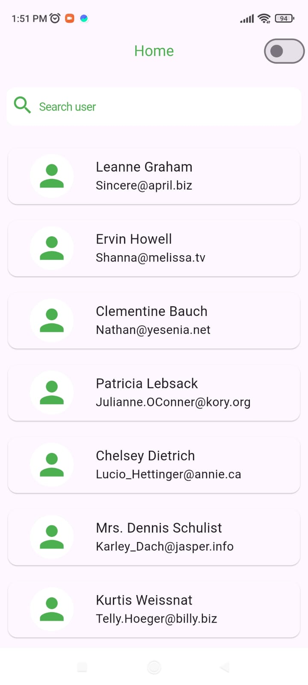
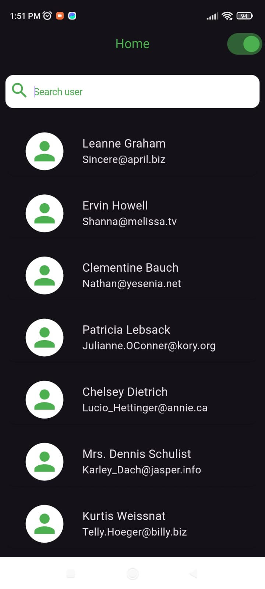
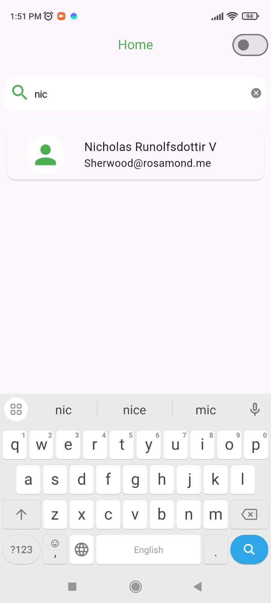
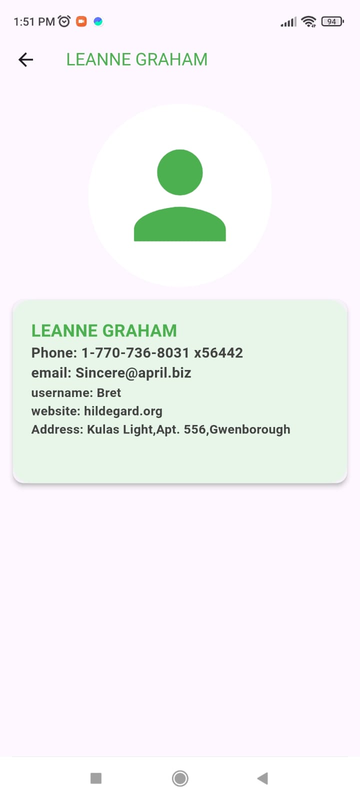
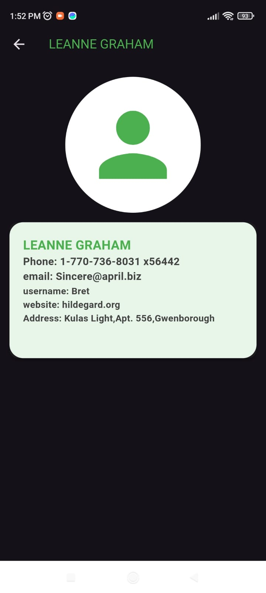
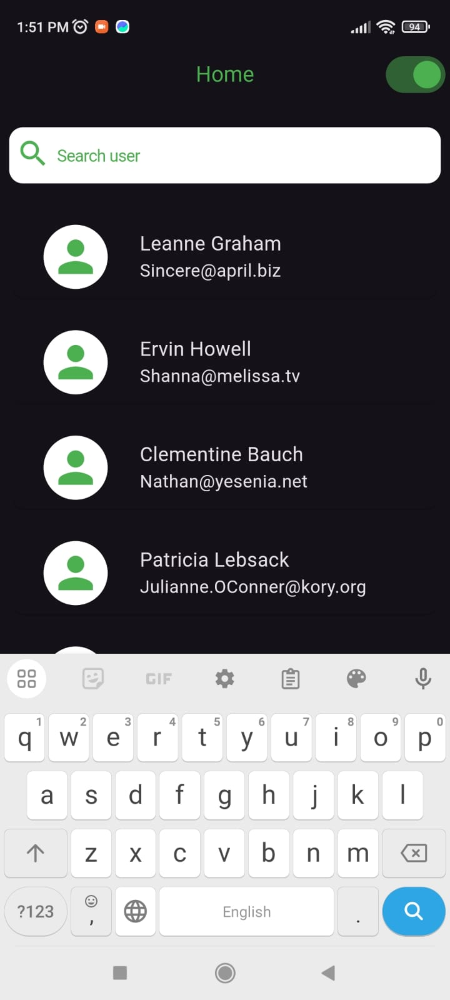

# appscrip

Appscrip assignment project.

## Instruction on how to run the app

## Clone the Repository
git clone https://github.com/apshuhaib/appscrip.git

cd your-repository

## Install Dependencies
flutter pub get

## Run the App
flutter run

## Build the App
flutter build apk   # For Android

flutter build ios   # For iOS

## notes
State Management: Used Bloc for state management to handle app state and business logic.

Folowed clean architecture : Domain Driven Design  

Theme Management: Implemented custom theme switching using ThemeBloc and SharedPreferences to persist theme choices.

UI/UX: Followed a minimal design approach with smooth transitions and a consistent color scheme.

Added shimmer effect for loading

Error Handling: Implemented error handling with SnackBars for better user experience in case of connectivity issues.

## screenshots

